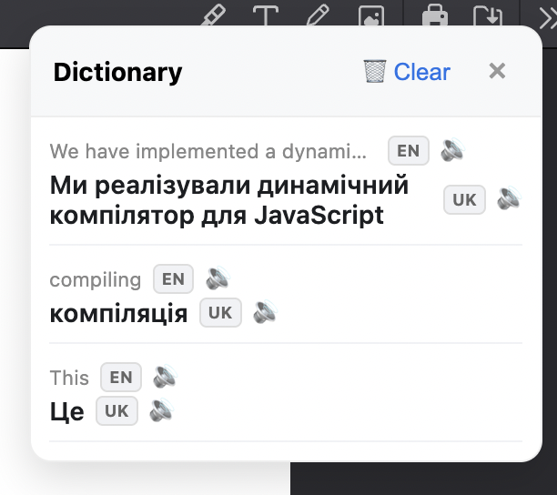

# Chrome Translation Extension

A simple and elegant Chrome extension that translates selected text to multiple languages with a draggable, minimalistic dictionary panel.



*The extension in action showing the dictionary panel with translations between English and Ukrainian, including language detection badges and audio pronunciation buttons.*

## Features


### 🌐 Universal Translation
- **Web Pages**: Works on any website
- **PDF Support**: Full support for PDF documents and viewers
- **Multi-language Support**: Translate to Ukrainian, English, Polish, Spanish, German
- **Auto Language Detection**: Automatically detects source language
- **Smart Text Selection**: Double-click or select text to translate
- **Text-to-Speech**: Audio pronunciation for translated text
- **Multiple APIs**: Uses multiple translation services with fallback support

### 🎨 User Interface
- **Draggable Panel**: Move the dictionary anywhere on the page
- **Minimalistic Design**: Clean gray color scheme
- **Compact Mode**: Toggle between normal and compact view
- **Minimize/Expand**: Collapse panel to header only
- **Resizable**: Drag corners to resize the panel

### 📚 Smart Dictionary
- **Persistent Storage**: All translations saved across sessions
- **Smart Ordering**: Recently used translations move to top
- **Individual Removal**: Remove specific translations with hover buttons
- **Translation Counter**: Shows total number of saved translations
- **No Duplicates**: Existing translations move to top instead of duplicating
- **Audio Playback**: Click to hear pronunciation of translations

### ⚙️ Easy Controls
- **Toggle On/Off**: Simple switch in extension popup
- **Compact Mode**: Toggle for minimalistic view
- **Clear All**: Remove all translations at once
- **Position Memory**: Panel remembers its position between sessions
- **Language Settings**: Configure interface and translation languages
- **Audio Controls**: Built-in text-to-speech for pronunciation
- **API Configuration**: Set up Google Cloud API key for premium translations

## Installation

1. Download or clone this repository
2. Open Chrome and navigate to `chrome://extensions/`
3. Enable "Developer mode" in the top right
4. Click "Load unpacked" and select the extension folder
5. The extension icon will appear in your Chrome toolbar

### Google Cloud API Key Setup (Optional)

For enhanced translation accuracy, you can configure a Google Cloud Translation API key:

1. **Create a Google Cloud Project**:
   - Go to [Google Cloud Console](https://console.cloud.google.com/)
   - Create a new project or select an existing one

2. **Enable Translation API**:
   - Navigate to "APIs & Services" > "Library"
   - Search for "Cloud Translation API"
   - Click on it and press "Enable"

3. **Create API Key**:
   - Go to "APIs & Services" > "Credentials"
   - Click "Create Credentials" > "API Key"
   - Copy the generated API key

4. **Configure in Extension**:
   - Right-click the extension icon and select "Options"
   - Choose your preferred interface language (Ukrainian/English)
   - Set your default translation language (Ukrainian, English, Polish, Spanish, German)
   - Paste your API key in the "Google Cloud API Key" field
   - Click "Save Settings"

**Note**: The extension works without an API key using free translation services. The Google Cloud API provides higher quality translations and better rate limits.

## Usage

### Basic Translation
1. Click the extension icon and toggle it ON
2. Navigate to any webpage or PDF
3. Double-click any word or select text
4. Translation appears in the left panel with:
   - Original text with auto-detected language
   - Translation in your selected target language
   - Audio pronunciation button (🔊) for listening to the translation

### Panel Controls
- **Move**: Drag the header to reposition the panel
- **Minimize**: Click the "−" button to collapse to header only
- **Close**: Click the "×" button to hide the panel
- **Remove**: Hover over translations and click the "×" to remove individual items
- **Audio**: Click the speaker icon (🔊) to hear pronunciation of any translation

### Settings
- **Toggle Extension**: Click extension icon to turn on/off
- **Compact Mode**: Enable in popup for smaller interface
- **Clear All**: Remove all saved translations
- **Advanced Settings**: Right-click extension icon > "Options" to access:
  - **Extension Language**: Choose interface language (Ukrainian/English)
  - **Default Translation Language**: Set target language (Ukrainian, English, Polish, Spanish, German)
  - **Google Cloud API Key**: Configure premium translation service

## PDF Support

The extension works seamlessly with PDF files:
- Automatically detects PDF viewers
- Handles PDF.js and other PDF rendering systems
- Cleans up PDF-specific formatting artifacts
- Supports dynamically loaded PDF content

## Configuration Options

Access advanced settings by right-clicking the extension icon and selecting "Options":

### Interface Settings
- **Extension Language**: Choose between Ukrainian and English for the extension interface
- **Default Translation Language**: Set your preferred target language for translations

### API Configuration  
- **Google Cloud API Key**: Enter your API key for premium translation quality
- **Automatic Fallback**: Extension automatically uses free services if API key is not configured

### Language Features
- **Automatic Detection**: The extension automatically detects the language of selected text
- **Multi-directional Translation**: Translate from any supported language to your target language
- **Audio Pronunciation**: Built-in text-to-speech for hearing correct pronunciation
- **Language Memory**: Remembers your preferred target language across sessions

### Language Options
The extension supports translation to:
- Ukrainian (Українська) - Default
- English - International communication
- Polish (Polski) - Regional support
- Spanish (Español) - Global language
- German (Deutsch) - European support

## Translation APIs

The extension uses multiple translation services with automatic fallback:

1. **Google Cloud Translation API** - Premium service (requires API key)
   - Highest translation quality
   - Better handling of context and idioms
   - Higher rate limits
   - Configured through extension options

2. **MyMemory API** - Primary free service
   - Good translation quality
   - No API key required
   - Rate limited

3. **LibreTranslate** - Backup free service
   - Open source translation service
   - No API key required
   - Fallback option

4. **Fallback Dictionary** - Offline support
   - Common words for basic translation
   - Works without internet connection

## Technical Details

### Files Structure
```
├── manifest.json       # Extension configuration
├── popup.html         # Extension popup interface
├── popup.js          # Popup functionality
├── content.js        # Main translation logic
├── background.js     # Background service worker
├── options.html      # Options page for API key configuration
├── options.js        # Options page functionality
├── styles.css        # Panel styling
├── icons/           # Extension icons
└── README.md         # This file
```

### Permissions
- `activeTab`: Access to current tab for text selection
- `storage`: Save translations and settings
- `<all_urls>`: Work on all websites including PDFs

## Development

### Local Development
1. Make changes to the code
2. Go to `chrome://extensions/`
3. Click the refresh icon on the extension card
4. Test your changes

### Contributing
1. Fork the repository
2. Create a feature branch
3. Make your changes
4. Test thoroughly
5. Submit a pull request

## Browser Compatibility

- **Chrome**: Fully supported (Manifest V3)
- **Edge**: Compatible with Chromium-based Edge
- **Other Browsers**: May work with Chromium-based browsers

## Privacy

- All translations are stored locally in Chrome's storage
- Google Cloud API key (if provided) is stored locally and only used for translation requests
- No personal data is sent to external servers except for translation requests
- Translation APIs receive only the selected text for translation
- API keys are never shared or transmitted to third parties

## License

This project is open source and available under the MIT License.

## Support

If you encounter any issues or have suggestions:
1. Check the browser console for error messages
2. Try disabling and re-enabling the extension
3. Reload the page and try again
4. Report issues on the GitHub repository

## Version History

### v1.0.0
- Initial release with basic translation functionality
- Draggable panel with minimize/expand controls
- PDF support with enhanced text selection
- Smart dictionary with individual item removal
- Compact mode and gray color scheme
- Multiple translation API support with fallbacks
